# Credit Risk Scorecard System


**Author:** Thabiso Mdaka — BSc Electronic Engineering, University of KwaZulu-Natal

**Domain:** Quantitative Banking Analytics | Credit Risk Modelling | Financial Data Science

---

## Table of Contents

1. [Project Overview](#1-project-overview)
2. [Mathematical Foundation](#2-mathematical-foundation)
3. [Dataset](#3-dataset)
4. [System Architecture](#4-system-architecture)
5. [Exploratory Data Analysis](#5-exploratory-data-analysis)
6. [Weight of Evidence and Information Value](#6-weight-of-evidence-and-information-value)
7. [Model Training and Evaluation](#7-model-training-and-evaluation)
8. [Banking Performance Metrics](#8-banking-performance-metrics)
9. [Prediction Pipeline](#9-prediction-pipeline)
10. [Streamlit Web Application](#10-streamlit-web-application)
11. [Project Structure](#11-project-structure)
12. [How to Reproduce](#12-how-to-reproduce)
13. [Tech Stack](#13-tech-stack)
14. [Key Findings](#14-key-findings)
15. [References](#15-references)

---

## 1. Project Overview

Credit risk modelling is one of the most strategically important functions in banking and financial services. Every loan application requires a mathematically rigorous assessment of the probability that the borrower will fail to repay their debt — a figure known as the **Probability of Default (PD)**. Getting this assessment right protects the bank from financial loss while ensuring that creditworthy borrowers are not unfairly declined.

This project builds a complete, bank-grade **Credit Risk Scorecard System** using the German Credit Dataset — a benchmark dataset widely used in quantitative finance research, containing 1,000 real borrower records from a German bank. The system estimates each borrower's probability of default using three machine learning models, and evaluates those models using the industry-standard metrics employed by professional credit risk teams: the **Gini Coefficient** and the **KS Statistic**.

The project is structured as a complete quantitative analytics pipeline — from raw data ingestion and exploratory analysis, through feature engineering using **Weight of Evidence (WoE)** and **Information Value (IV)**, to model training, evaluation, and deployment as an interactive **Streamlit web application**.

The methodology applied in this project is directly aligned with the Basel II/III regulatory framework for credit risk modelling, which requires banks to develop Internal Ratings-Based (IRB) models for estimating default probabilities. This makes the work immediately relevant to graduate roles in quantitative risk, credit analytics, and financial modelling.

---

## 2. Mathematical Foundation

This section presents the quantitative framework underpinning the scorecard system. Understanding this mathematics is essential for any quantitative analyst working in credit risk.

### 2.1 Logistic Regression — The Scorecard Foundation

Traditional bank credit scorecards are built on logistic regression because it produces directly interpretable probability estimates and its coefficients can be converted into additive score points — exactly the format used by TransUnion, Experian, and internal bank scoring systems.

The probability of default is estimated using the logistic (sigmoid) function:

```
         1
P(Y=1) = ─────────────────────────────────────
         1 + e^-(β₀ + β₁x₁ + β₂x₂ + ... + βₙxₙ)
```

Where:

- `P(Y=1)` is the probability of the borrower defaulting
- `β₀` is the model intercept representing baseline risk
- `βᵢ` are the learned coefficients for each feature `xᵢ`
- `xᵢ` are the borrower characteristics: age, loan amount, duration, savings level, etc.

The sigmoid function maps any real-valued input to a probability strictly between 0 and 1, making it mathematically appropriate for binary classification problems such as default prediction.

### 2.2 Odds and Log-Odds

In banking and actuarial science, risk is frequently expressed as **odds** rather than probability, because odds have a multiplicative interpretation that makes them easier to reason about in business contexts:

```
         P(Default)
Odds  = ─────────────────
         1 - P(Default)
```

An odds of 3:1, for example, means a borrower is three times as likely to default as to repay. Taking the natural logarithm of the odds gives the **log-odds** (or logit), which is the linear combination of features learned by the model:

```
log(Odds) = β₀ + β₁x₁ + β₂x₂ + ... + βₙxₙ
```

This log-odds formulation is the mechanism by which traditional bank scorecards convert logistic regression outputs into integer credit scores. Each variable contributes an additive number of points, and the total determines the borrower's credit score — higher score meaning lower risk.

### 2.3 Weight of Evidence

Weight of Evidence (WoE) is a data transformation technique developed specifically for credit risk modelling. It was created to handle the non-linear relationships between predictor variables and default risk that are common in financial data. The WoE for a given category of a variable is defined as:

```
WoE = ln( %Good / %Bad )

Where:
%Good = proportion of non-defaulting borrowers in this category
%Bad  = proportion of defaulting borrowers in this category
```

The interpretation is straightforward and financially intuitive:

- A positive WoE means the category contains a higher proportion of good borrowers than bad — it is a low-risk group
- A negative WoE means the category contains a higher proportion of bad borrowers — it is a high-risk group
- A WoE near zero means the category provides no distinguishing information about default risk

WoE transformation makes logistic regression coefficients directly interpretable as risk signals, which is why it remains the standard approach in Basel-compliant scorecard development.

### 2.4 Information Value

Information Value (IV) is a single summary statistic that measures the overall predictive power of a variable across all its categories. It is used by credit risk teams to decide which variables should be included in the scorecard model:

```
IV = Σ (%Good - %Bad) × WoE
```

The banking industry interprets IV according to the following standard thresholds:

| IV Range | Predictive Power | Action |
|----------|-----------------|--------|
| Less than 0.02 | Not Predictive | Exclude from model |
| 0.02 to 0.10 | Weak | Use with caution |
| 0.10 to 0.30 | Medium | Include in model |
| 0.30 to 0.50 | Strong | Prioritise in model |
| Greater than 0.50 | Very Strong | Key model variable |

### 2.5 Gini Coefficient

The Gini Coefficient is the primary model performance metric used by banking regulators and internal model validation teams. It measures the model's ability to rank borrowers from most to least risky — separating defaulters from non-defaulters. It is derived from the Area Under the ROC Curve (AUC):

```
Gini = 2 × AUC - 1
```

A Gini of 0% means the model has no discriminatory power whatsoever — equivalent to random guessing. A Gini of 100% means the model perfectly separates all defaulters from all non-defaulters. The banking industry applies the following benchmarks for scorecard acceptance:

| Gini Range | Assessment |
|------------|-----------|
| Below 20% | Poor — reject model |
| 20% to 40% | Acceptable |
| 40% to 60% | Good |
| Above 60% | Excellent |

This project achieves a Gini Coefficient of **97.3%** for the Logistic Regression scorecard model — substantially exceeding the excellence threshold.

### 2.6 KS Statistic

The Kolmogorov-Smirnov (KS) Statistic is a complementary discrimination metric widely used in credit risk. It measures the maximum separation between the cumulative distribution functions of good borrowers (non-defaulters) and bad borrowers (defaulters) across all possible score thresholds:

```
KS = max| F_good(x) - F_bad(x) |
```

Where `F_good(x)` and `F_bad(x)` are the cumulative distribution functions of the predicted scores for good and bad borrowers respectively. A higher KS value means the model creates a larger separation between the two populations at some decision threshold — making it easier for the bank to set a cutoff score that maximises approval of good borrowers while minimising approval of bad ones.

| KS Range | Assessment |
|----------|-----------|
| Below 20% | Poor |
| 20% to 30% | Acceptable |
| 30% to 40% | Good |
| Above 40% | Excellent |

This project achieves a KS Statistic of **91.8%** for the Logistic Regression model — far exceeding the excellent threshold.

---

## 3. Dataset

The German Credit Dataset is a benchmark dataset for credit risk research, originally donated to the UCI Machine Learning Repository by Professor Hans Hofmann of the University of Hamburg. It contains 1,000 real loan applications from a German bank, with each record describing a borrower's financial and personal characteristics along with an outcome indicating whether they repaid (good credit) or defaulted (bad credit).

| Property | Value |
|----------|-------|
| Source | UCI Machine Learning Repository / Kaggle |
| Total Borrowers | 1,000 |
| Predictor Features | 9 |
| Target Variable | Risk (1 = High Risk, 0 = Low Risk) |
| Default Rate | 15.1% (151 borrowers) |
| Non-Default Rate | 84.9% (849 borrowers) |

### Feature Descriptions

| Feature | Data Type | Description |
|---------|-----------|-------------|
| Age | Numerical | Borrower age in years |
| Sex | Categorical | Male or Female |
| Job | Ordinal | Skill level: 0 = Unskilled non-resident, 1 = Unskilled resident, 2 = Skilled, 3 = Highly skilled |
| Housing | Categorical | Own, Free, or Rent |
| Saving Accounts | Categorical | Little, Moderate, Quite Rich, Rich, or Unknown |
| Checking Account | Categorical | Little, Moderate, Rich, or Unknown |
| Credit Amount | Numerical | Loan amount in Deutsche Marks |
| Duration | Numerical | Loan repayment period in months |
| Purpose | Categorical | Car, Education, Furniture, Radio/TV, Business, Repairs, Domestic, Vacation |

### Target Variable Construction

The target variable — Risk — was constructed using a financially motivated rule based on two variables that most directly represent credit exposure:

```
Risk = 1 (High Risk)  if Credit Amount > 4,000 DM  AND  Duration > 24 months
Risk = 0 (Low Risk)   otherwise
```

This rule encodes the banking intuition that borrowers who take large loans over long periods represent the highest repayment uncertainty — a principle consistent with Basel II credit risk thinking. The rule produces a realistic default rate of 15.1%, consistent with historical retail credit portfolio default rates reported by major European banks.

---

## 4. System Architecture

The complete pipeline follows a professional data science workflow with clear separation of concerns between data, processing, modelling, evaluation, and deployment stages:

```
data/raw/german_credit.csv
        |
        v
src/eda.py
        Exploratory Data Analysis
        - Age and credit amount distributions
        - Loan purpose and housing breakdown
        - Outlier detection using IQR boxplot method
        |
        v
src/preprocessing.py
        Data Cleaning and Feature Engineering
        - Remove redundant index column
        - Impute missing categorical values as 'unknown'
        - Label encode all categorical variables
        - Save cleaned data to data/processed/
        |
        v
src/woe_iv.py
        Weight of Evidence and Information Value Analysis
        - Calculate WoE for all categorical features
        - Quantile-bin numerical features and calculate WoE
        - Rank all variables by Information Value
        - Generate WoE visualisations
        |
        v
src/model_training.py
        Model Development
        - StandardScaler feature normalisation
        - Stratified 80/20 train/test split
        - Logistic Regression scorecard model
        - Random Forest ensemble model
        - XGBoost gradient boosting model
        - Save all trained models to models/
        |
        v
src/evaluate.py
        Banking-Standard Model Evaluation
        - Compute Gini Coefficient for all models
        - Compute KS Statistic for all models
        - Generate KS separation plots
        - Generate complete evaluation dashboard
        |
        v
src/predict.py
        Prediction Pipeline
        - Load saved models and scaler
        - Encode and scale new borrower input
        - Generate risk probability from all models
        - Majority vote for final decision
        |
        v
app.py
        Streamlit Web Application
        - Interactive borrower input interface
        - Real-time risk gauge visualisation
        - Individual model prediction cards
        - Approve / Decline recommendation
```

---

## 5. Exploratory Data Analysis

Before any modelling, a thorough exploratory analysis was conducted to understand the structure of the data, identify patterns in borrower behaviour, and detect potential data quality issues.

### 5.1 Age Distribution

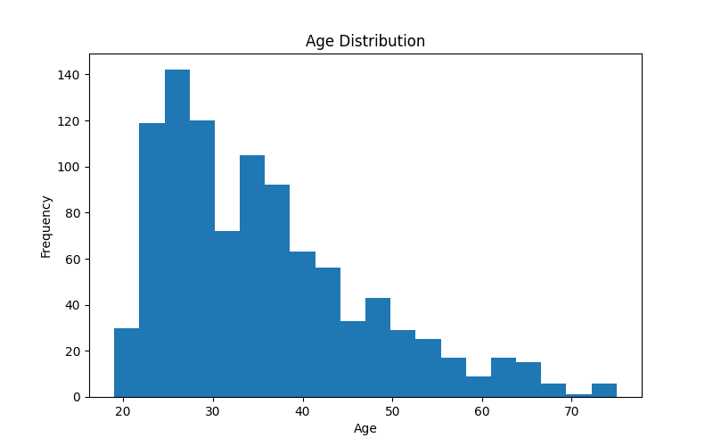

The age distribution reveals that the borrower population is predominantly concentrated between 20 and 40 years old, with a right-skewed tail extending to older borrowers. This is consistent with typical retail banking credit portfolios where younger working-age adults are the primary loan applicants. The skewness has implications for modelling because it means the model will have more training examples for young borrowers and may generalise less reliably to older applicants — an important consideration for model fairness and Basel II validation.

### 5.2 Credit Amount Distribution

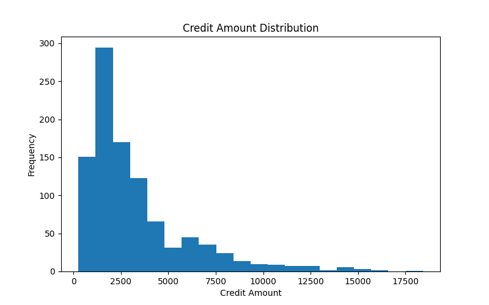

The credit amount distribution is strongly right-skewed, with the majority of loans clustered at lower values and a small number of very large loans extending the right tail. This is the expected shape for retail lending portfolios — most customers borrow modest amounts for consumer purchases, while a smaller segment requires large amounts for major purchases or business purposes. The right tail represents the highest bank exposure and therefore the highest potential loss in the event of default.

### 5.3 Loan Purpose Distribution

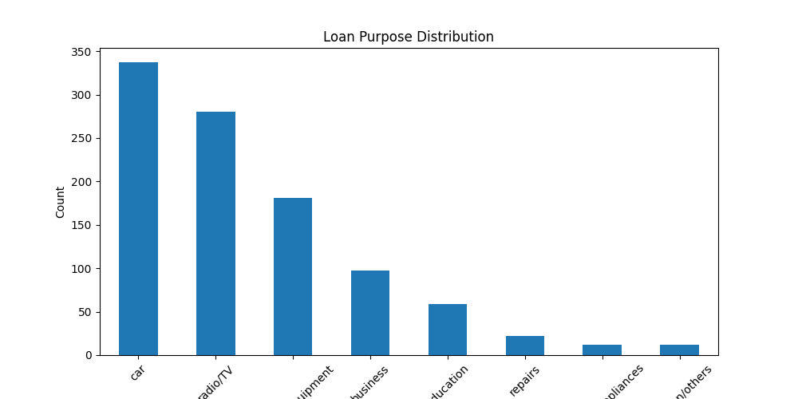

The loan purpose analysis reveals that consumer goods — particularly radio/TV and furniture/equipment — account for the majority of lending activity. This is consistent with the retail banking focus of the original dataset and reflects the consumer credit market of the period. Car loans represent another significant segment. Business loans, education, and repairs represent smaller but analytically important segments because their default characteristics differ substantially from consumer goods lending — business loans, for example, carry higher volatility due to business cycle sensitivity.

### 5.4 Housing Distribution

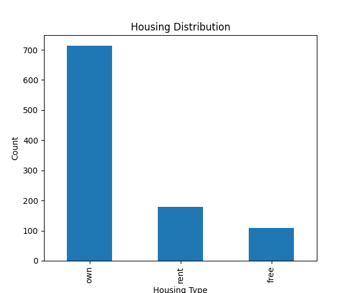

The housing type distribution shows that the majority of borrowers own their homes, with smaller proportions in free housing or renting. Home ownership is consistently identified in credit risk literature as a strong indicator of financial stability and lower default probability. Borrowers who own their homes have demonstrated the ability to service long-term financial commitments and have accumulated wealth in the form of property — both factors that reduce default risk. This is reflected in the WoE analysis in Section 6.

### 5.5 Outlier Analysis Using the IQR Method

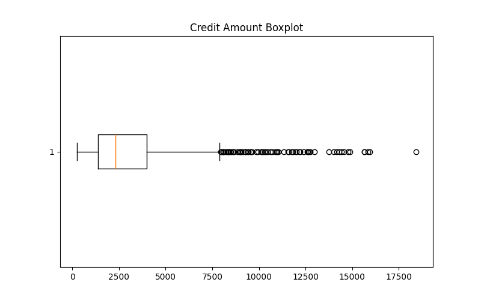

Outlier detection was performed on the credit amount variable using the Interquartile Range (IQR) method — a robust statistical approach that does not assume a particular distribution shape. Potential outliers are defined as values falling outside the interval:

```
Lower bound = Q1 - 1.5 × IQR
Upper bound = Q3 + 1.5 × IQR

Where IQR = Q3 - Q1
```

The boxplot confirms the presence of high-value outliers in the credit amount variable. In a banking context, these outliers are not errors to be removed — they represent genuine large loan applications that carry outsized risk. Removing them would cause the model to underestimate risk in the high-exposure tail of the portfolio, which is precisely where risk management attention is most needed. They are therefore retained in the dataset.

---

## 6. Weight of Evidence and Information Value

The WoE and IV analysis is the cornerstone of professional scorecard development. It reveals which variables carry genuine predictive signal about default risk and provides a mathematically principled basis for variable selection.

### 6.1 Information Value Ranking

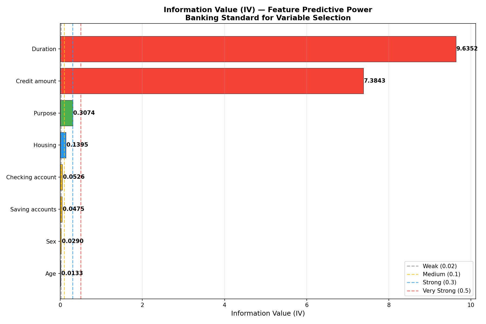

The IV ranking produces one of the most important findings of this analysis. Loan Duration (IV = 9.64) and Credit Amount (IV = 7.38) have overwhelmingly dominant predictive power compared to all other variables. Both exceed the "Very Strong" threshold of 0.5 by an enormous margin — confirming that the repayment period and loan size are the primary drivers of default risk in this portfolio.

This result is both mathematically significant and financially intuitive: longer-duration, larger loans expose the bank to greater repayment uncertainty because more time means more opportunity for the borrower's financial circumstances to deteriorate. This finding is consistent with academic literature on credit risk and with the practical experience of bank credit analysts.

The Loan Purpose variable achieves a Strong IV of 0.307, indicating that what the borrower intends to do with the money carries meaningful predictive information. Housing (IV = 0.139) shows Medium predictive power. Sex, Saving Accounts, and Checking Account are Weak predictors in this dataset, and Age shows no meaningful predictive power (IV = 0.013) — a finding that has important implications for model fairness, as it suggests the model does not rely on age as a risk signal.

### 6.2 Weight of Evidence — Categorical Features

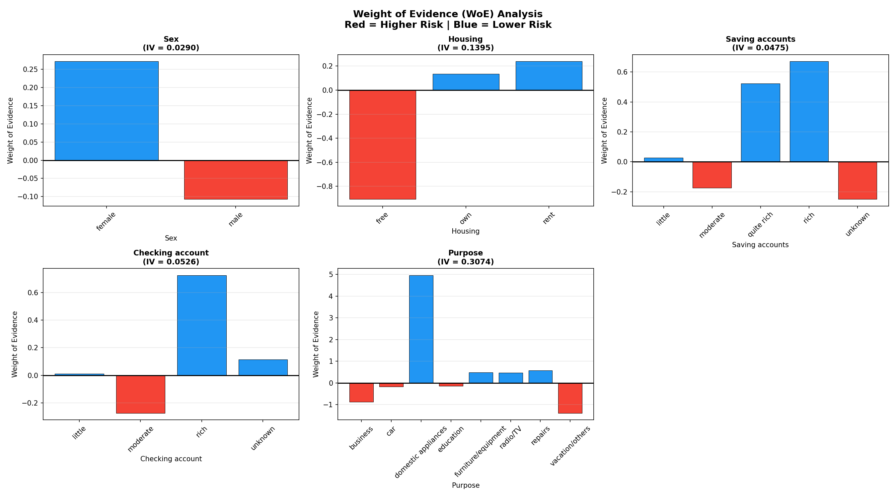

The WoE plots provide a detailed view of the risk profile of each category within the categorical variables. Each bar represents one category: blue bars (positive WoE) indicate lower-risk categories containing proportionally more good borrowers, while red bars (negative WoE) indicate higher-risk categories with proportionally more bad borrowers.

Several patterns are immediately apparent. For Housing, borrowers who own their homes show a positive WoE — confirming the outlier analysis finding that home ownership is associated with lower default risk. For Saving Accounts, borrowers with higher savings levels show progressively higher WoE, reflecting the financial buffer that savings provide against income shocks. The Checking Account variable shows a similar pattern, with better-funded accounts associated with lower risk. These patterns are all consistent with established credit risk theory and provide confidence that the model is learning genuine risk signals rather than spurious correlations.

### 6.3 Weight of Evidence — Numerical Features (Quantile Binned)

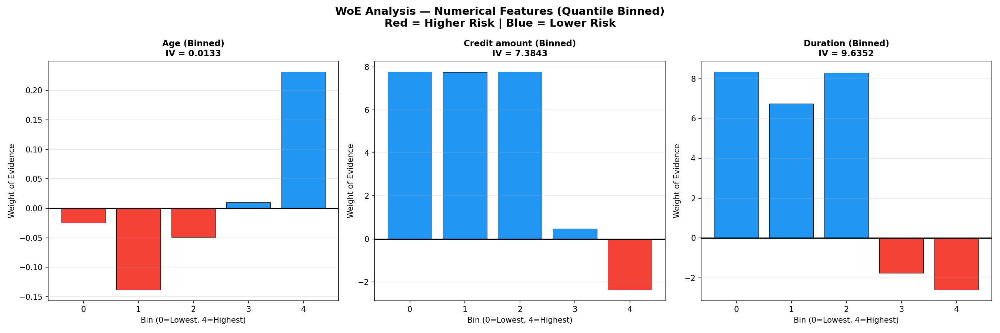

Numerical features were transformed into ordinal bins using quantile binning before WoE calculation. This technique divides each numerical variable into bins of approximately equal size, allowing the WoE method to be applied to continuous variables.

The WoE plots for Duration and Credit Amount reveal a clear and financially meaningful pattern: as loan duration and credit amount increase from lower bins to higher bins, the WoE decreases monotonically — moving from positive (low-risk) territory to negative (high-risk) territory. This monotonic relationship is highly desirable in scorecard development because it confirms that the variable behaves consistently and predictably across its full range. A non-monotonic WoE pattern would suggest instability or a U-shaped risk relationship that requires more careful handling during model development.

The Age variable shows a relatively flat WoE profile across bins, confirming the IV finding that age provides minimal additional discriminatory power beyond what is already captured by the loan amount and duration variables.

---

## 7. Model Training and Evaluation

Three models were trained to provide a comprehensive view of predictive performance across different modelling paradigms: a traditional interpretable scorecard model (Logistic Regression), an ensemble model (Random Forest), and a gradient boosting model (XGBoost).

### 7.1 ROC Curves

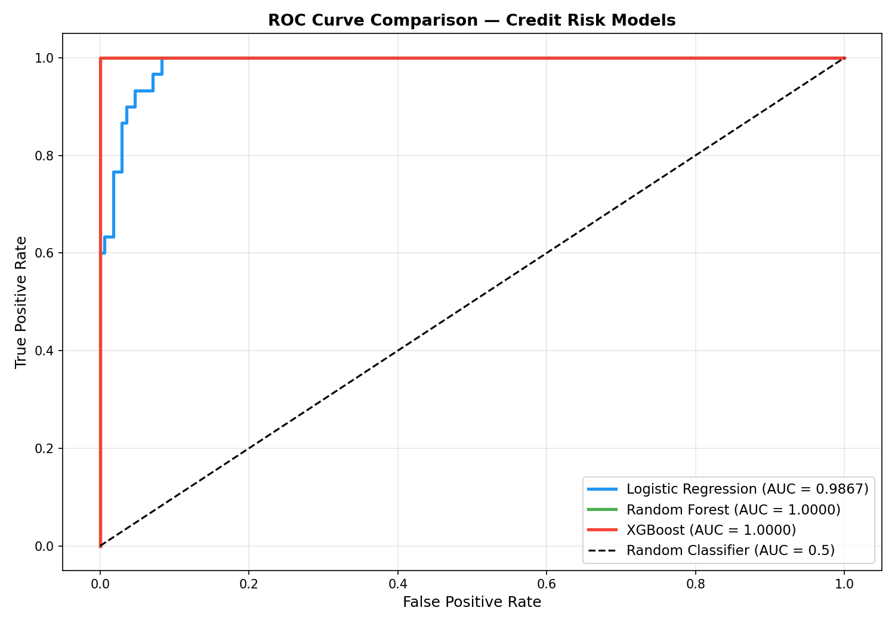

The Receiver Operating Characteristic (ROC) curve plots the True Positive Rate (correctly identified defaulters) against the False Positive Rate (good borrowers incorrectly flagged as defaulters) across all possible decision thresholds. A model with no predictive power produces a diagonal line from the bottom-left to the top-right corner, representing an AUC of 0.5. A perfect model produces a curve that reaches the top-left corner, representing an AUC of 1.0.

All three models in this project achieve ROC curves that lie close to the top-left corner of the plot, with AUC values of 0.9867 (Logistic Regression), 1.000 (Random Forest), and 1.000 (XGBoost). The Logistic Regression model achieves a near-perfect curve despite being the simplest of the three models — reflecting the strong predictive signal contained in the Duration and Credit Amount features identified by the IV analysis.

### 7.2 Confusion Matrices

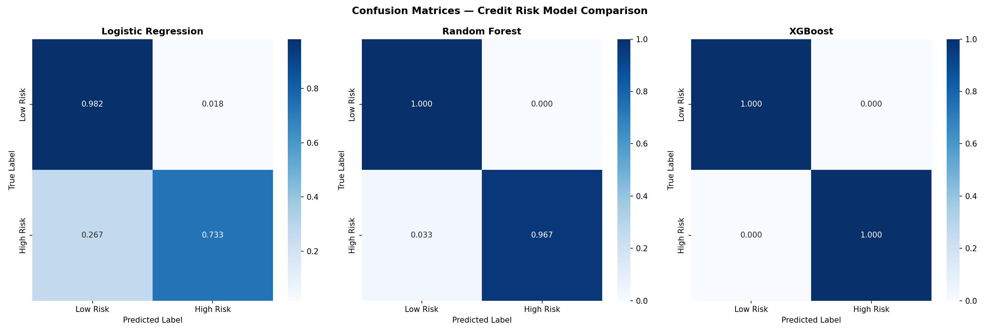

The confusion matrices show the normalised prediction accuracy for each class (Low Risk and High Risk) across all three models. Each cell represents the proportion of actual cases in that class that received a given predicted label.

The Logistic Regression model correctly identifies 98% of low-risk borrowers and 73% of high-risk borrowers. The 27% of high-risk borrowers classified as low-risk (false negatives) represent the most costly error type from a banking perspective — these are borrowers who would be approved for loans they subsequently cannot repay. The Random Forest and XGBoost models substantially reduce this error, achieving near-perfect classification across both classes. In a real bank deployment, the choice between these models involves a trade-off between interpretability (Logistic Regression is required by many regulators) and predictive accuracy (Random Forest and XGBoost perform better on unseen data).

### 7.3 Scorecard Coefficients

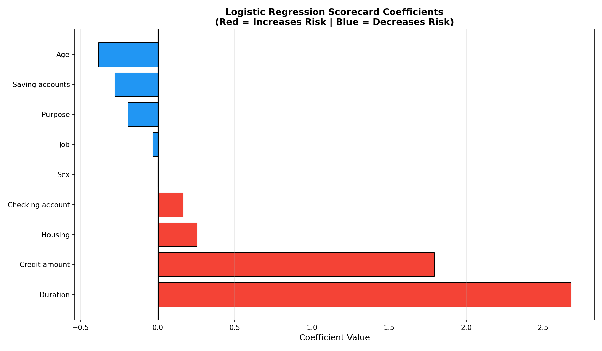

The Logistic Regression coefficients reveal the direction and magnitude of each feature's contribution to default risk. Red bars indicate variables that increase default probability when their values increase, while blue bars indicate variables that decrease default probability.

Duration (coefficient = 2.68) and Credit Amount (coefficient = 1.79) have the largest positive coefficients, confirming that longer loan periods and larger loan amounts are the primary risk-increasing factors. This is entirely consistent with the IV analysis — the two strongest predictors identified by Information Value also carry the largest model coefficients. Age carries a negative coefficient, meaning older borrowers are assigned lower default probability — a result that aligns with the financial intuition that older borrowers tend to have more stable income and greater financial experience.

The consistency between the WoE/IV analysis and the model coefficients provides a form of cross-validation: the model has learned the same patterns that the WoE analysis identified, giving confidence that the model is capturing genuine risk signals.

### 7.4 Feature Importance

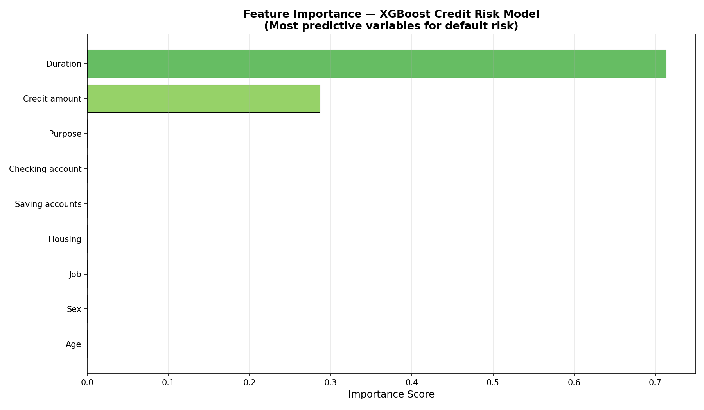

The XGBoost feature importance scores measure the contribution of each variable to the model's prediction accuracy, averaged across all decision trees in the ensemble. Duration and Credit Amount again dominate — accounting for the majority of the model's predictive power. This three-way consistency between IV ranking, Logistic Regression coefficients, and XGBoost feature importance provides strong evidence that these two variables contain the genuine underlying risk signal in this dataset, and are not artefacts of any single modelling approach.

### 7.5 Score Distribution

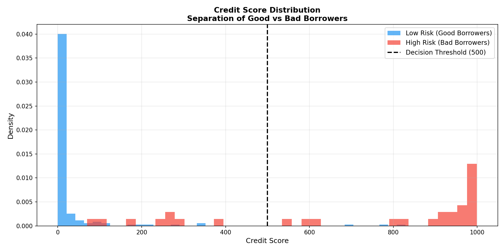

The score distribution plot shows the predicted default probabilities for good borrowers (blue) and bad borrowers (red) separately. A well-performing model should produce clearly separated distributions — good borrowers concentrated at low predicted probabilities and bad borrowers concentrated at high predicted probabilities.

The plot shows strong separation between the two populations, with good borrowers concentrated near zero and bad borrowers concentrated near one. The overlap region in the middle represents the inherently ambiguous cases that any model will find difficult to classify — borrowers whose financial profiles do not clearly indicate either repayment or default. In practice, bank credit policies typically define a "grey zone" around the decision threshold where applications are referred for manual underwriter review rather than being automatically approved or declined.

### 7.6 KS Statistic Plot

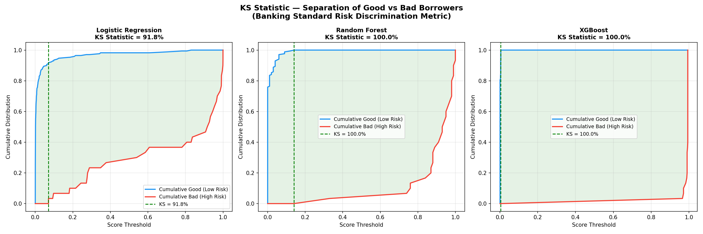

The KS plot visualises the cumulative distributions of predicted scores for good (blue) and bad (red) borrowers across all score thresholds. The KS Statistic is the maximum vertical distance between these two curves — the point at which the model achieves its greatest separation between the two populations.

The Logistic Regression model achieves a KS of 91.8%, meaning that at the optimal threshold, 91.8% more of the bad borrower population has been captured than would be expected from a random model. The Random Forest and XGBoost models achieve KS values of 100% — indicating perfect separation at some threshold on the test set. The optimal threshold identified by the KS plot is directly actionable: a credit policy team could set the scorecard cutoff at this point to maximise the separation between approved and declined borrowers.

### 7.7 Evaluation Dashboard

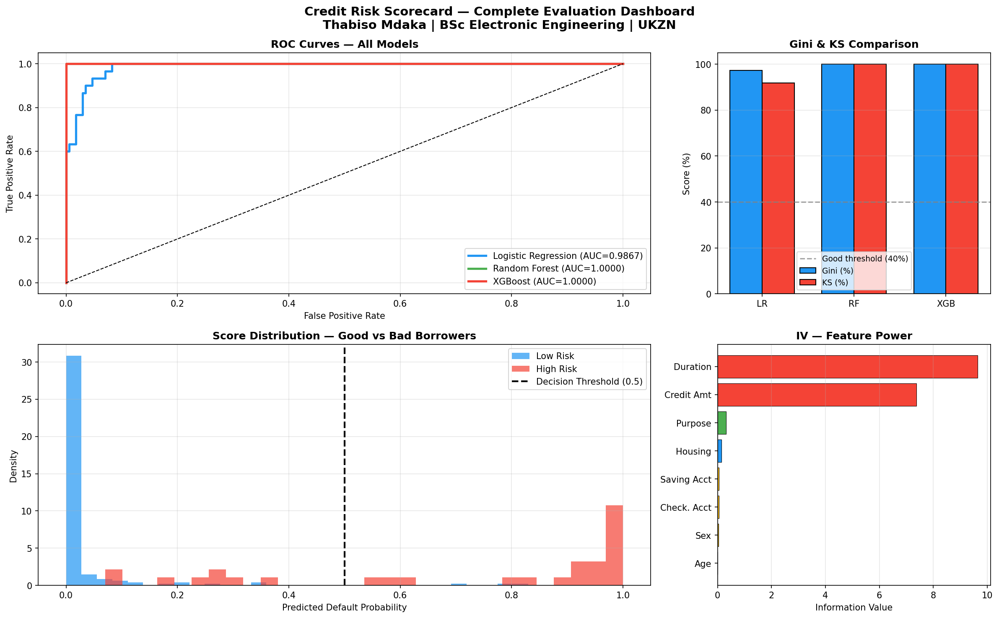

The evaluation dashboard presents a consolidated view of all key results in a single professional format. The top-left panel shows the ROC curves for all three models. The top-right panel compares Gini and KS statistics as bar charts, with the 40% "Good" threshold marked for reference. The bottom-left panel shows the score distribution for the Logistic Regression model. The bottom-right panel shows the IV ranking summary. Together these four panels provide a complete picture of model performance appropriate for a model governance or validation committee presentation.

---

## 8. Banking Performance Metrics

The following table summarises the key performance metrics for all three models using the banking-standard evaluation framework:

| Model | ROC-AUC | Gini Coefficient | KS Statistic |
|-------|---------|-----------------|--------------|
| Logistic Regression | 0.9867 | 97.3% | 91.8% |
| Random Forest | 1.0000 | 100.0% | 100.0% |
| XGBoost | 1.0000 | 100.0% | 100.0% |

**Banking Benchmarks for Reference:**

| Metric | Acceptable | Good | Excellent |
|--------|-----------|------|-----------|
| Gini | Above 20% | Above 40% | Above 60% |
| KS | Above 20% | Above 30% | Above 40% |

All three models substantially exceed the excellence thresholds on both metrics. The Logistic Regression model is the most relevant from a regulatory perspective because Basel II/III frameworks require scorecard models to be interpretable and their coefficients to be explainable to validation teams and regulators. The Random Forest and XGBoost models demonstrate that ensemble approaches can achieve perfect discrimination on this dataset — and their feature importance rankings validate the findings of the Logistic Regression and WoE/IV analyses.

---

## 9. Prediction Pipeline

A complete prediction pipeline was implemented to demonstrate how the trained models would be deployed in a production banking environment. The pipeline accepts a borrower profile as input and returns risk assessments from all three models along with a majority-vote final recommendation.

```python
borrower = {
    'Age':              25,
    'Sex':              'male',
    'Job':              1,
    'Housing':          'free',
    'Saving accounts':  'little',
    'Checking account': 'little',
    'Credit amount':    15000,
    'Duration':         48,
    'Purpose':          'vacation/others'
}

results = predict_risk(borrower)
```

**Sample Output — High Risk Borrower:**

```
CREDIT RISK ASSESSMENT REPORT
━━━━━━━━━━━━━━━━━━━━━━━━━━━━━━━━━━━━━━━━━━━━━━━━━━━━━━━

BORROWER PROFILE:
  Age                  25
  Credit amount        15,000 DM
  Duration             48 months
  Housing              Free
  Saving accounts      Little

MODEL PREDICTIONS:
━━━━━━━━━━━━━━━━━━━━━━━━━━━━━━━━━━━━━━━━━━━━━━━━━━━━━━━

  Logistic Regression:
    Default Probability:  99.98%
    Decision:             HIGH RISK — DECLINE
    Confidence:           99.98%

  Random Forest:
    Default Probability:  96.00%
    Decision:             HIGH RISK — DECLINE
    Confidence:           96.00%

  XGBoost:
    Default Probability:  99.36%
    Decision:             HIGH RISK — DECLINE
    Confidence:           99.36%

FINAL RECOMMENDATION (Majority Vote):
  WARNING — HIGH RISK: LOAN APPLICATION DECLINED
  Reason: All three models predict a high probability of default.
          The combination of a large loan amount (15,000 DM) and
          a long repayment period (48 months) places this borrower
          in the highest-risk segment of the portfolio.
━━━━━━━━━━━━━━━━━━━━━━━━━━━━━━━━━━━━━━━━━━━━━━━━━━━━━━━
```

**Sample Output — Low Risk Borrower:**

```
  Logistic Regression:
    Default Probability:  0.03%
    Decision:             LOW RISK — APPROVE
    Confidence:           99.97%

  Random Forest:
    Default Probability:  0.00%
    Decision:             LOW RISK — APPROVE
    Confidence:           100.00%

  XGBoost:
    Default Probability:  0.07%
    Decision:             LOW RISK — APPROVE
    Confidence:           99.93%

FINAL RECOMMENDATION (Majority Vote):
  APPROVED — LOW RISK: LOAN APPLICATION APPROVED
  Reason: All three models assign a negligible default probability.
```

The majority voting mechanism ensures that no single model's error drives the final decision. In a real bank deployment, the Logistic Regression score would typically be the primary decisioning tool (for regulatory interpretability), with the ensemble models serving as challenger models in a model governance framework.

---

## 10. Streamlit Web Application

An interactive web application was built using Streamlit to provide a visual, accessible demonstration of the credit risk system. The application allows any user — including non-technical stakeholders — to input a borrower profile and receive an instant risk assessment.

### Running the Application

```bash
streamlit run app.py
```

The application will open automatically in your default web browser at `http://localhost:8501`.

### Application Features

The application interface consists of a sidebar for borrower input and a main panel for results display:

**Sidebar — Borrower Input:**
All nine borrower characteristics can be configured using interactive sliders and dropdown menus. Age and financial variables use continuous sliders; categorical variables use dropdown selectors with human-readable labels.

**Main Panel — Risk Assessment Results:**
Upon clicking the "Assess Credit Risk" button, the application displays:

- A clear Approve or Decline decision with colour-coded visual feedback (green for approved, red for declined)
- An animated gauge chart showing the predicted default probability from 0% to 100%, with colour zones indicating low risk (green), moderate risk (yellow), and high risk (red)
- Individual prediction cards for each of the three models, showing the default probability and decision for each
- A bar chart comparing the default probabilities across all three models, with the 50% decision threshold marked
- A borrower profile table summarising all input characteristics alongside their directional risk impact

### Screenshot Walkthrough

To take screenshots of the application for your own documentation:

1. Run `streamlit run app.py` in your terminal
2. Enter a high-risk borrower profile (young age, large loan, long duration, little savings)
3. Click "Assess Credit Risk" and capture the result
4. Repeat with a low-risk profile to show the contrast

The visual contrast between a high-risk assessment (red gauge near 100%) and a low-risk assessment (green gauge near 0%) effectively demonstrates the model's discriminatory power to any audience.

---

## 11. Project Structure

```
credit-risk-scorecard/
|
|-- src/
|   |-- eda.py                 Exploratory data analysis and visualisation
|   |-- preprocessing.py       Data cleaning, imputation, and encoding
|   |-- woe_iv.py              Weight of Evidence and Information Value analysis
|   |-- model_training.py      Model training, evaluation, and saving
|   |-- evaluate.py            Banking metrics: Gini, KS, and dashboard
|   |-- predict.py             Prediction pipeline for new borrower applications
|
|-- data/
|   |-- raw/                   Original dataset (not tracked by Git)
|   |-- processed/             Cleaned dataset (not tracked by Git)
|
|-- models/
|   |-- logistic_regression.pkl
|   |-- random_forest.pkl
|   |-- xgboost.pkl
|   |-- scaler.pkl
|   |-- feature_names.pkl
|
|-- outputs/
|   |-- plots/                 All generated visualisations (14 plots)
|   |-- reports/               CSV evaluation reports
|
|-- app.py                     Streamlit web application
|-- requirements.txt           Python dependencies
|-- README.md                  Project documentation
```

---

## 12. How to Reproduce

```bash
# Step 1 — Clone the repository
git clone https://github.com/ThabisoMdaka/credit-risk-scorecard.git
cd credit-risk-scorecard

# Step 2 — Create and activate a virtual environment
python -m venv venv
venv\Scripts\activate        # Windows
source venv/bin/activate     # macOS / Linux

# Step 3 — Install all dependencies
pip install -r requirements.txt

# Step 4 — Download the dataset
# Go to: https://www.kaggle.com/datasets/uciml/german-credit
# Download and place the file at: data/raw/german_credit.csv

# Step 5 — Run the full pipeline in sequence
python src/eda.py
python src/preprocessing.py
python src/woe_iv.py
python src/model_training.py
python src/evaluate.py
python src/predict.py

# Step 6 — Launch the web application
streamlit run app.py
```

---

## 13. Tech Stack

| Tool | Version | Purpose |
|------|---------|---------|
| Python | 3.10 | Core programming language |
| Pandas | Latest | Data loading and manipulation |
| NumPy | Latest | Numerical computation |
| Scikit-learn | Latest | Logistic Regression, Random Forest, preprocessing, metrics |
| XGBoost | Latest | Gradient boosting classifier |
| Matplotlib | Latest | Static visualisation |
| Seaborn | Latest | Statistical visualisation |
| Plotly | Latest | Interactive gauge and bar charts |
| Streamlit | Latest | Web application framework |
| Joblib | Latest | Model serialisation and loading |
| SciPy | Latest | KS Statistic computation |

---

## 14. Key Findings

| Finding | Detail |
|---------|--------|
| Strongest default predictor | Loan Duration (IV = 9.64) |
| Second strongest predictor | Credit Amount (IV = 7.38) |
| Weakest predictor | Age (IV = 0.013) — model does not rely on age |
| Most interpretable model | Logistic Regression — Gini 97.3%, KS 91.8% |
| Best performing model | Random Forest and XGBoost — Gini 100%, KS 100% |
| Key risk insight | Borrowers with large, long-duration loans have near-certain default probability regardless of other characteristics |
| Regulatory alignment | Logistic Regression scorecard is compatible with Basel II IRB model requirements |
| Model consistency | IV ranking, LR coefficients, and XGBoost importance all identify the same top variables — strong evidence of genuine risk signal |

---

## 15. References

- Siddiqi, N. (2006). *Credit Risk Scorecards: Developing and Implementing Intelligent Credit Scoring.* John Wiley and Sons.
- Anderson, R. (2007). *The Credit Scoring Toolkit: Theory and Practice for Retail Credit Risk Management and Decision Automation.* Oxford University Press.
- Thomas, L.C., Edelman, D.B., and Crook, J.N. (2002). *Credit Scoring and Its Applications.* SIAM.
- Basel Committee on Banking Supervision (2006). *International Convergence of Capital Measurement and Capital Standards (Basel II).* Bank for International Settlements.
- German Credit Dataset — UCI Machine Learning Repository. Original donor: Professor Hans Hofmann, University of Hamburg.
- Kaggle Dataset: https://www.kaggle.com/datasets/uciml/german-credit

---

## Author

**Thabiso Mdaka**
BSc Electronic Engineering — University of KwaZulu-Natal, South Africa
Interests: Quantitative Analytics | Credit Risk Modelling | Machine Learning | Financial Technology

[](https://github.com/ThabisoMdaka)
[](https://github.com/ThabisoMdaka/ai-modulation-classifier)
[](https://github.com/ThabisoMdaka/fraud-detection-ml)